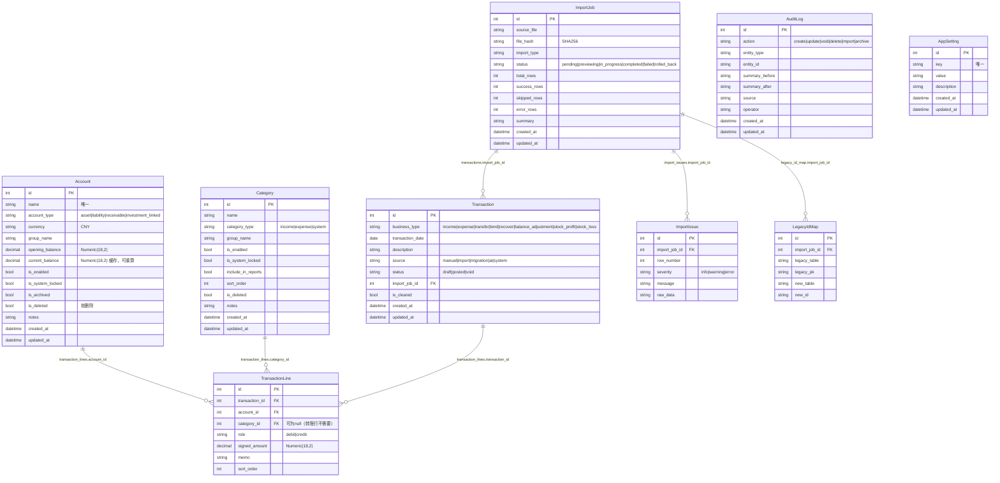

# 核心数据模型（Core Data Model）

## ER 图

## 交易行配对规则（金额守恒）

每种业务类型的 TransactionLine 必须满足 `SUM(signed_amount) = 0`：

| 业务类型 | 行1 (debit) | 行2 (credit) | 说明 |
|---|---|---|---|
| income | 资产账户 +amount | 收入分类 -amount | 收入 |
| expense | 支出分类 +amount | 资产账户 -amount | 支出 |
| transfer | 转入账户 +amount | 转出账户 -amount | 转账 |
| lend | 应收账户 +amount | 资产账户 -amount | 垫付 |
| recover | 资产账户 +amount | 应收账户 -amount | 收回 |
| balance_adjustment | 目标账户 ±amount | 系统分类 ∓amount | 余额调整 |
| stock_profit | 资产账户 +amount | 收入分类 -amount | 股票盈利 |
| stock_loss | 支出分类 +amount | 资产账户 -amount | 股票亏损 |

## 字段约束

- `signed_amount`：必填，Decimal，精度18位，小数2位
- `transaction_date`：必填，不能是未来日期
- `account_id`：必填，账户必须存在且启用
- `category_id`：转账行可为null，收入/支出/应收/调整必须有有效分类
- 资产账户的 signed_amount: debit为正表示增加，credit为正表示减少
- 同账户不可互转
- 普通记账的账户不能是 receivable 或 investment_linked 类型

## 索引

- `accounts.name` UNIQUE
- `categories(name, category_type)` UNIQUE
- `app_settings.key` UNIQUE
- `transactions.transaction_date` INDEX
- `transactions.status` INDEX
- `transaction_lines.transaction_id` INDEX (FK)
- `transaction_lines.account_id` INDEX
- `transaction_lines.category_id` INDEX
