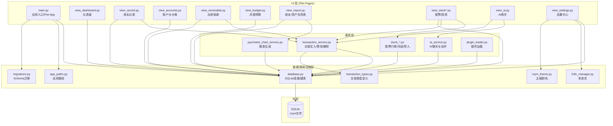

# 旧系统模块关系图（Legacy Module Map）

> 依据：旧项目 Flet 源码结构。本图展示旧系统 UI 层 → 服务层 → 数据层的调用关系。

## 模块关系图



## 关键调用路径

### 1. 记一笔（核心路径）
```
view_record.py → transaction_service.py → database.py → SQLite
```

### 2. 仪表盘查询
```
view_dashboard.py → database.py (直接SQL查询) → SQLite
```

### 3. 报表生成
```
view_report.py → pyecharts_chart_service.py → database.py → SQLite
```

### 4. AI 记账
```
view_ai.py → ai_service.py → transaction_service.py → database.py → SQLite
```

### 5. 股票月结
```
view_stock*.py → stock_*.py → transaction_service.py → database.py → SQLite
```

### 6. 应收账款
```
view_receivable.py → transaction_service.py → database.py → SQLite
```

## 旧系统关键风险点

| 风险点 | 涉及文件 | 描述 |
|---|---|---|
| UI 直写 SQL | `view_dashboard.py`, `view_accounts.py`, `view_budget.py` | 多个页面绕过服务层直接执行SQL查询 |
| 跨线程 SQLite | `stock_*.py`, `ai_service.py` | 后台线程共享数据库连接 |
| 浮点金额 | 多处 | 部分金额计算使用float而非Decimal |
| 破坏性 Migration | `migrations.py` | 直接在旧.mym上ALTER TABLE |
| 股票重复统计 | `view_dashboard.py` | 股票联动账户可能被重复计入总资产 |

---

## 关键旧代码引用

### 数据库连接（database.py）
- `get_db()` - 获取数据库连接
- `init_db()` - 初始化数据库表
- `get_db_path()` - 获取数据库路径

### 交易服务（transaction_service.py）
- `add_transaction()` - 添加交易
- `update_transaction()` - 更新交易
- `delete_transaction()` - 删除交易
- `recalculate_balances()` - 余额重算

### 交易类型（transaction_types.py）
- `TransactionType` 枚举 - 收入/支出/转账/垫付/收回/余额调整/股票月结等

### 迁移（migrations.py）
- `migrate_database()` - 执行迁移
- `check_schema_version()` - 检查版本
